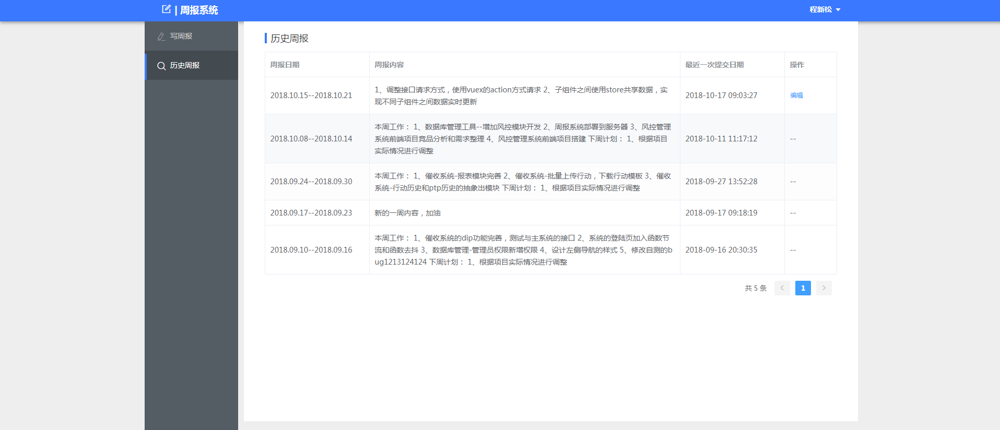
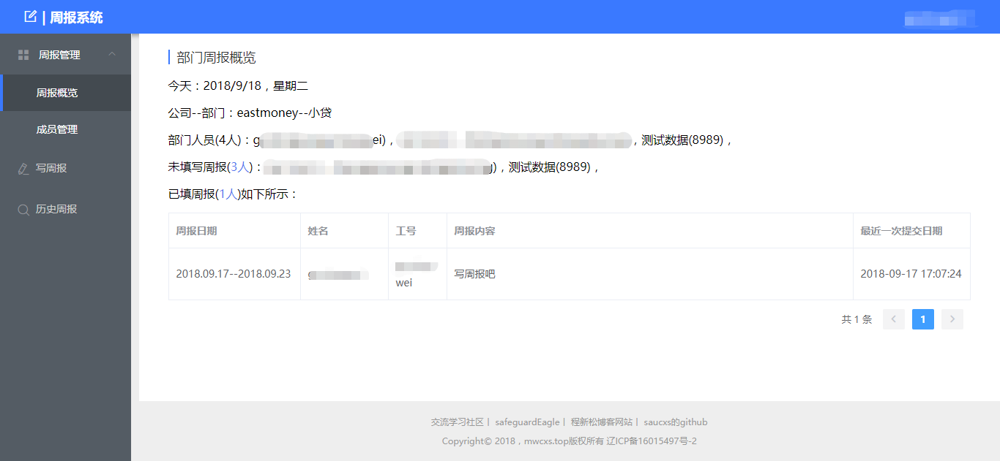
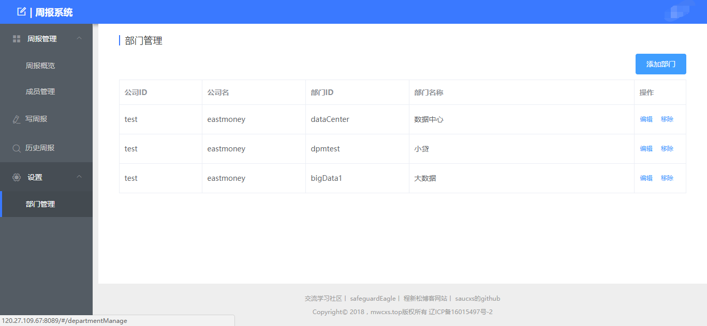
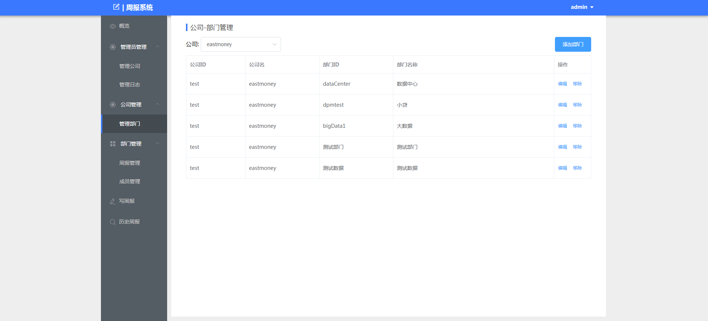

# [weekly](https://github.com/saucxs/weekly)
[](https://github.com/saucxs/weekly)
[](https://github.com/saucxs/weekly/blob/master/LICENSE)
[](https://github.com/saucxs/weekly/stargazers)
[](https://github.com/saucxs/weekly/network)
[](https://github.com/saucxs/weekly/issues)

周报系统主要是node+vue+redis+mysql+es6，一个企业管理系统，企业员工汇报每周工作情况，以及完成情况，各级负责人可以查看和提醒相应未写周报人员。
，后端完全使用`nodeJS`，数据库使用`mysql`，基于`nodejs的thinkjs框架搭建的`，
支持：
> + 1、所有人周报提交修改；
> + 2、所有人周报自身周报历史查看；
> + 3、部门经理查看部门周报填写情况，增删改部门人员；
> + 4、总监（或公司拥有者）查看所有人的周报填写情况，增删改公司人员，增删改公司部门；
> + 5、管理员权限，增删改公司总监；

如果喜欢`nodeJS`写的后端，支持大前端，支持全栈开发，请请`star`并`fork`项目。系统地址为：[周报weekly企业管理平台](http://120.27.109.67:8089)。
如有使用问题请留言。

### 一、技术栈
> + ThinkJS（ Node端框架） [官方网站](https://thinkjs.org/)
> + Vue.js（客户端双向数据绑定框架）  [官方网站](https://cn.vuejs.org/)

### 二、版本功能
- [x] Element UI
- [x] 登录/注销
- [x] 个人中心
- [x] 修改用户信息
- [x] 修改密码
- [x] mysql
- [x] 写周报
- [x] 个人历史周报
- [x] 部门人员管理
- [x] 部门周报情况
- [x] 公司的部门新建，修改，删除

+ 2018.09.18
   - 完成基本版本的功能
+ 2018.10.10
    - 管理员权限优化
    - 优化权限管理

### 三、系统截图
#### 3.1 登录页

#### 3.2 成员页面

#### 3.3 部门经理页面

#### 3.4 总监页面

#### 3.5 管理员页面


### 四、本地运行程序
1、首先你的环境是nodejs，不会安装配置参考：[nodejs环境搭建](http://www.mwcxs.top/page/440.html)

2、clone下来项目
````
git clone https://github.com/saucxs/weekly.git
````
3、分别针对前端vue的weekly-web的文件夹和node后端weekly-node，安装相应依赖
````
npm install
````
4、安装redis（可以考虑安装RedisDesktopManager）

参考：[安装window下的redis，redis可视化管理工具（Redis Desktop Manager）安装，基础使用，实例化项目](http://www.mwcxs.top/page/441.html)

5、安装mysql，这个就不赘述

6、修改nodejs的后端的配置文件adapter.js，config.js这两个文件中

````
adapter.js

exports.cache = {
    type: 'redis',
    common: {
        timeout: 24 * 60 * 60 * 1000 // millisecond
    },
    redis: {
        handle: redisCache,
        host: '127.0.0.1',
        port: 6379,
        password: 'a123456'  //redis安装时候设置的秘密
    }
};
//
//
exports.model = {
  type: 'mysql',
  common: {
    logConnect: true,
    logSql: true,
    logger: msg => think.logger.info(msg)
  },
  mysql: {
    handle: mysql,
    database: 'weekly',
    prefix: 'week_',
    encoding: 'utf8',
    host: '127.0.0.1',   //本地数据库
    port: '3306',　　　　　//数据库端口
    user: 'root',    //数据库的用户名
    password: '123456',    //数据库该用户名的密码
    dateStrings: true
  }
};
````
7、分别对前后端分离的项目启动

(1)前端vue的weekly-web的启动
````
npm run dev
 ````

(2)和node后端weekly-node的启动
````
npm start
 ````
